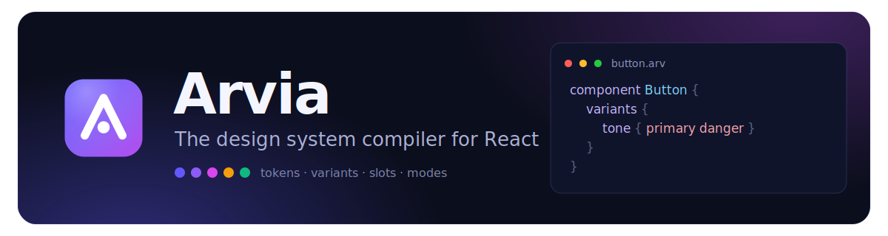

<p align="center">
  
</p>

# Arvia

**A design system compiler for React.**

Write `.arv` files describing themes, tokens, recipes, and components. Arvia compiles them into optimized CSS and typed TypeScript APIs — zero runtime styling cost.

```tsx
import { Button } from "./button.arv";

const styles = Button({ size: "lg", tone: "danger" });
<button className={styles.root}>Delete</button>;
```

```css
component Button {
  variants {
    size {
      sm {
      }
      lg {
      }
    }
    tone {
      primary {
      }
      danger {
      }
    }
  }
  defaults {
    size: sm;
    tone: primary;
  }
}
```

---

## Why Arvia

Arvia is not CSS-in-JS. Styles resolve at **build time**.

Arvia is not a preprocessor. You describe **design system primitives** — tokens, variants, slots, recipes — and get framework-ready output.

|              | Arvia                           |
| ------------ | ------------------------------- |
| Runtime cost | None — static CSS               |
| Variants     | Typed props with autocomplete   |
| Tokens       | First-class theme groups        |
| Composition  | Recipes, slots, `clsx`          |
| Tooling      | Vite plugin, LSP, Storybook gen |

---

## Quick start

```bash
npm install -D @arviahq/vite-plugin-react
```

**vite.config.ts**

```ts
import { defineConfig } from "vite";
import react from "@vitejs/plugin-react";
import { arvia } from "@arviahq/vite-plugin-react";

export default defineConfig({
  plugins: [arvia({ theme: "src/theme.arv" }), react()],
});
```

**tsconfig.json**

```json
{
  "compilerOptions": {
    "plugins": [{ "name": "@arviahq/typescript-plugin" }]
  }
}
```

**src/theme.arv**

```css
theme {
  color { primary = #635bff; text = #111; }
  space { 2 = 8px; 4 = 16px; }
  radius { md = 8px; }
}
```

**src/main.tsx** — import the theme once for global CSS and variables:

```ts
import "./theme.arv";
```

**src/button.arv**

```css
component Button {
  base {
    padding: space.2 space.4;
    border-radius: radius.md;
    background: color.primary;
    color: white;
  }
}
```

**App.tsx**

```tsx
import { Button } from "./button.arv";

export function App() {
  const s = Button();
  return <button className={s.root}>Click me</button>;
}
```

---

## Language

### Theme & tokens

```css
theme {
  color { primary = #635bff; }
  space { 2 = 8px; }
  radius { md = 8px; }
  font { sm = 13px; }
  duration { fast = 120ms; }
  easing { out = cubic-bezier(0.16, 1, 0.3, 1); }
  breakpoint { md = 768px; }
  container { wide = 480px; }
}
```

Reference tokens with dot notation: `color.primary`, `space.4`.

Theme values may reference tokens declared earlier (aliases):

```css
theme {
  color { base = #635bff; accent = color.base; }
  border { thin = 1px solid color.accent; }
}
```

### States & group hover

`&`-states support selector lists, pseudo-elements, and combinators — whitespace after `&` is significant (`& .child` = descendant, `&.active` = compound). A slot block inside a state styles that slot when the owner matches:

```css
component Button {
  slots {
    root {
    }
    icon {
    }
  }

  base {
    &:hover,
    &:focus-visible {
      filter: brightness(1.05);
      icon {
        transform: translateX(2px);
      } /* group hover */
    }
  }
}
```

### Theme modes

```css
theme {
  modes: light | dark;
  color {
    text = #111;
    @dark { text = #eee; }
  }
}
```

The first mode follows the OS color scheme; set `data-arvia-theme` on `<html>` to override (e.g. from a theme toggle):

```ts
document.documentElement.setAttribute("data-arvia-theme", "dark");
```

### Global styles

```css
global {
  body {
    margin: 0;
    color: color.text;
  }
}
```

### Recipes

Reusable fragments composed with `use`:

```css
recipe Surface {
  border: 1px solid #e5e5e5;
  background: white;
}

component Card {
  use Surface;
  padding: 16px;
}
```

### Components

```css
component Button {
  base {
    display: inline-flex;
    icon {
      flex-shrink: 0;
    }
  }

  slots {
    root {
    }
    icon {
    }
    label {
      font-weight: 500;
    }
  }

  variants {
    size {
      sm {
      }
      lg {
      }
    }
    tone {
      primary {
      }
      danger {
      }
    }
  }

  defaults {
    size: sm;
    tone: primary;
  }

  compound {
    size: sm;
    tone: danger;
    root {
      font-weight: 700;
    }
  }

  responsive {
    md {
      size: lg;
    }
  }
}
```

Top-level declarations without a `base` block map to the implicit **root** slot.

### Responsive props

```tsx
Button({ size: { initial: "sm", md: "lg" } });
```

### Container queries

```css
container {
  wide {
    layout: row;
  }
}
```

```tsx
Card({ layout: { initial: "stacked", $wide: "row" } });
```

Container props use a `$` prefix. The root slot gets `container-type: inline-size` automatically.

### Keyframes

```css
keyframes fadeIn {
  from {
    opacity: 0;
  }
  to {
    opacity: 1;
  }
}

component Box {
  base {
    animation: keyframes.fadeIn duration.fast;
  }
}
```

### Styles

Standalone exported classes — no component ceremony. Declarations, `use`, and `&`-states only (variants or slots → use a component):

```css
style truncate {
  overflow: hidden;
  text-overflow: ellipsis;
  white-space: nowrap;
}
```

```tsx
import { truncate } from "./utils.arv";

<p className={truncate}>Long text…</p>;
```

Styles are emitted after components in the CSS, so a composed style wins the cascade.

### Local tokens

A `tokens` block inside a component declares values scoped to that component, shadowing the theme with the same `group.name` syntax:

```css
component Chip {
  tokens {
    space { pad = 6px; }
  }
  base {
    padding: space.pad space.2; /* local pad, theme space.2 */
  }
}
```

Local tokens are compile-time constants: they inline to literals (even under theme modes) and never leak into other components or the token catalog.

### Token documentation

```css
primary = #635bff doc "Brand primary — CTAs and links";
```

Doc strings appear in LSP hover and generated token catalogs.

---

## Tooling

### `@arviahq/vite-plugin-react`

React + Vite entrypoint: Vite plugin, `arvia` CLI, and a dependency on `@arviahq/typescript-plugin` for editor types.

Compiles `.arv` imports to JS + extracted CSS. Theme edits trigger full reload; style-only edits hot-swap CSS.

### CLI

```bash
arvia gen src/                                    # emit .d.ts
arvia gen --docs --theme src/theme.arv          # token catalog
arvia gen --storybook --theme src/theme.arv src/ # Storybook stories
```

### Language server

Diagnostics, completion, and hover for `.arv` files. The VS Code extension starts it automatically.

TypeScript variant props come from `@arviahq/typescript-plugin` as virtual module declarations — no `.d.ts` files on disk required during development.

### Class composition

Use [`clsx`](https://github.com/lukeed/clsx) (or any class-name utility) to merge generated class strings:

```tsx
import clsx from "clsx";

<button className={clsx(styles.root, isActive && styles.active)} />;
```

---

## Examples

| Project                                                    | Description                                        |
| ---------------------------------------------------------- | -------------------------------------------------- |
| [`website`](./website)                                     | Documentation site — styled entirely with Arvia    |
| [`examples/demo`](./examples/demo)                         | Interactive playground + Storybook                 |
| [`examples/demo/src/recipes`](./examples/demo/src/recipes) | Short, one-feature-per-file snippets (Recipes tab) |

```bash
pnpm install
pnpm website      # docs site
pnpm demo         # playground
pnpm demo:storybook
```

---

## Packages

| Package                  | Purpose                                            |
| ------------------------ | -------------------------------------------------- |
| `@arviahq/vite-plugin-react`           | **Install this** — React Vite plugin + `arvia` CLI |
| `@arviahq/compiler`        | Lexer, parser, checker, CSS/JS/d.ts emit           |
| `@arviahq/vite-plugin`            | Vite plugin + `arvia` CLI (used by `@arviahq/vite-plugin-react`) |
| `@arviahq/typescript-plugin`  | TypeScript plugin (used by `@arviahq/vite-plugin-react`)         |
| `@arviahq/language-server` | LSP for editors                                    |
| `@arviahq/storybook`       | Storybook CSF generator                            |
| `@arviahq/docs`            | Token catalog generator                            |

---

## Publishing

See [PUBLISHING.md](./PUBLISHING.md) for npm org setup, changesets, and Marketplace release steps.

## Development

```bash
pnpm install
pnpm build
pnpm test
pnpm typecheck
pnpm lint
```

---

## License

MIT
